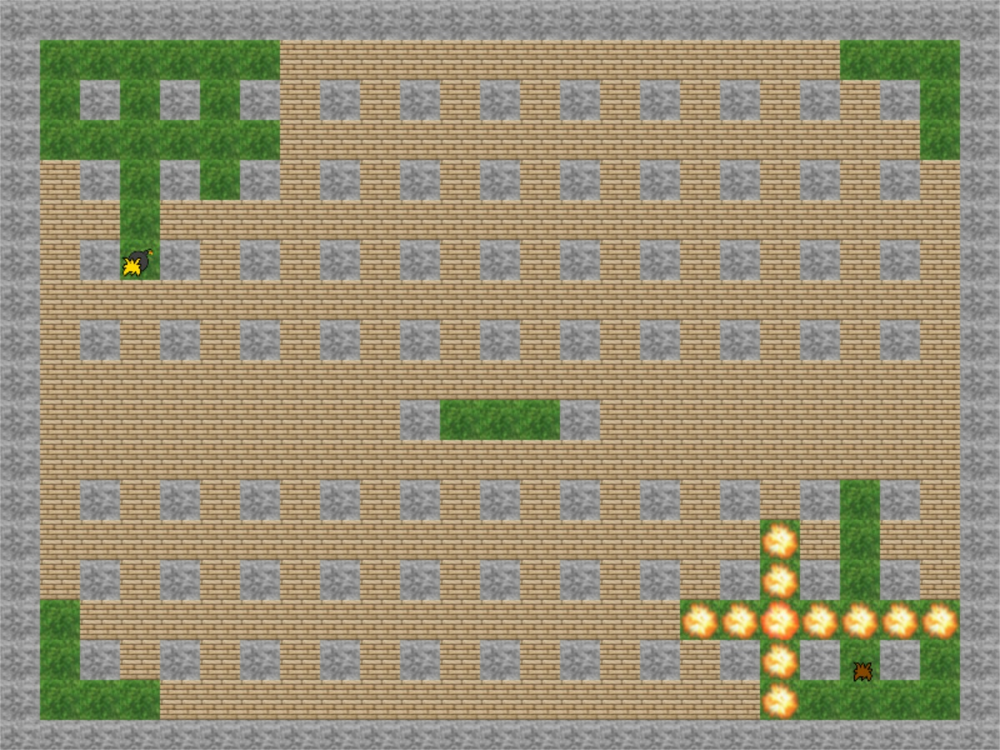
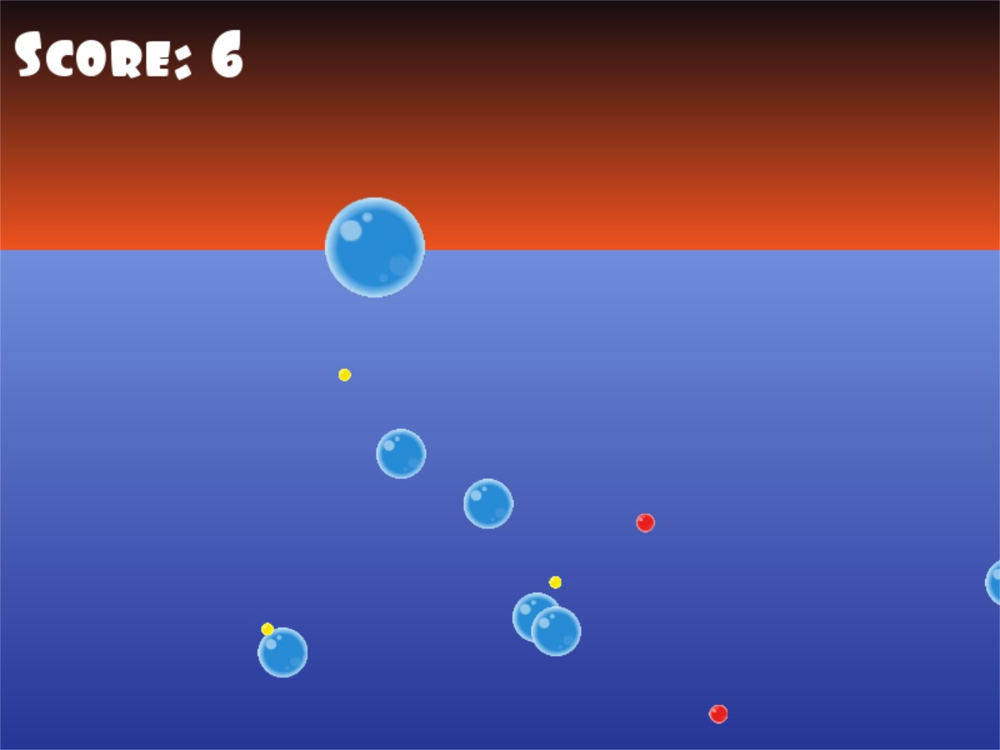
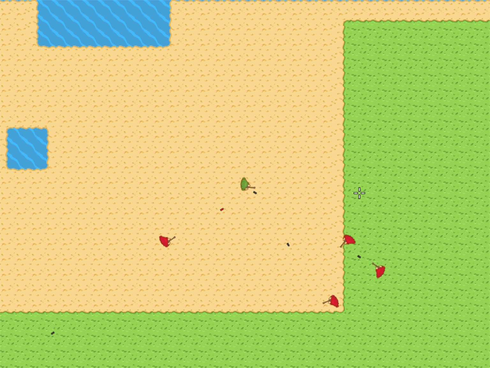
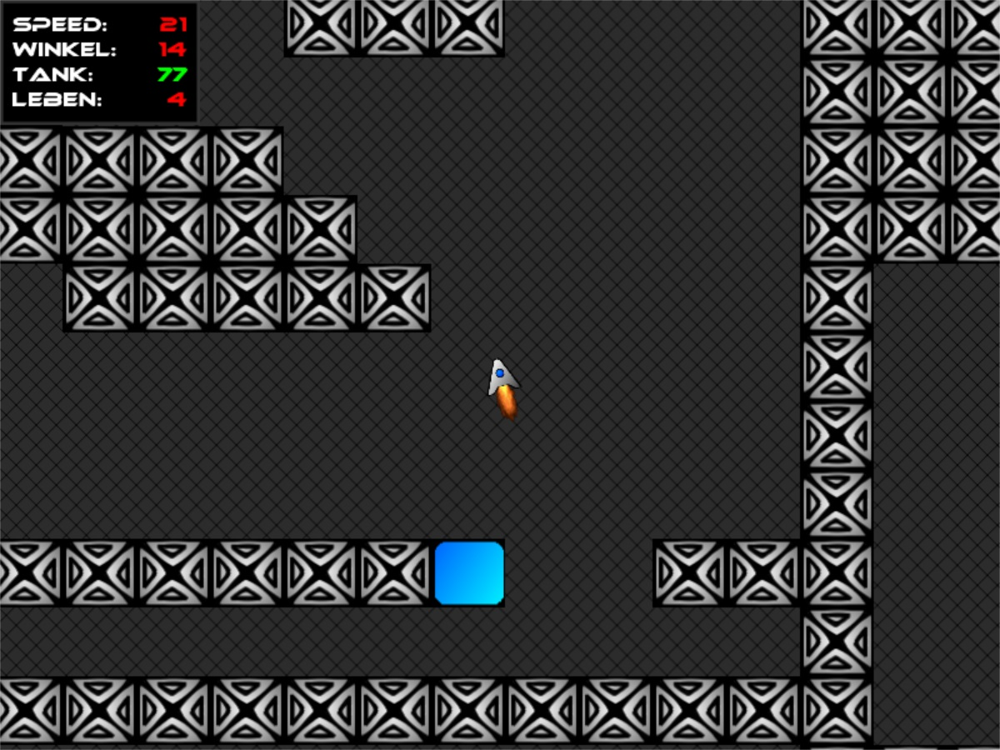
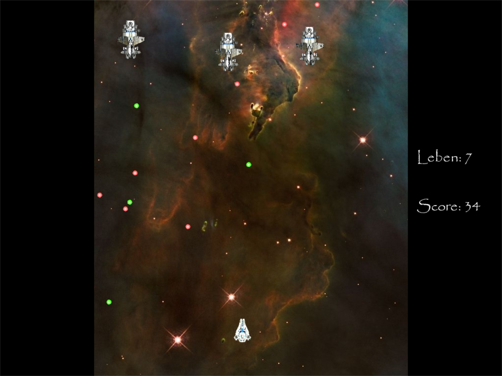
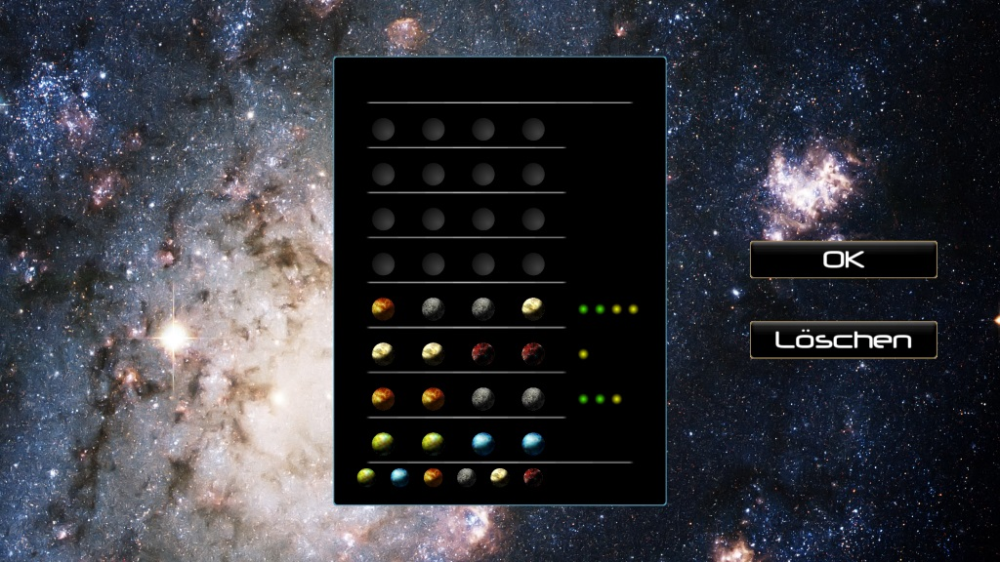

# SFML Community Contest 

The **SFML Community Contest  (SCC)** was a game programming contest in the German SFML forum. Duration of the contest usually was 1-2 weeks. The contest existed from about 2011-2014 and thus also the entries compiled in this repository are from this period. Unfortunately neither the contest nor the forum exist anymore.

## Bomberman

## BubbleHunt

## LexThree

## Lunar Lander

## Osiris

## Spacemind

